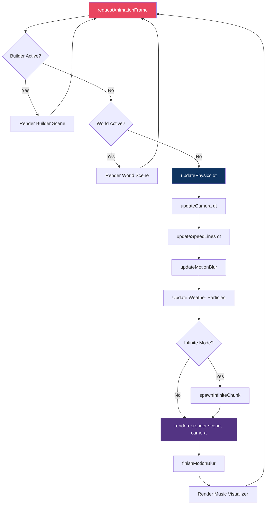
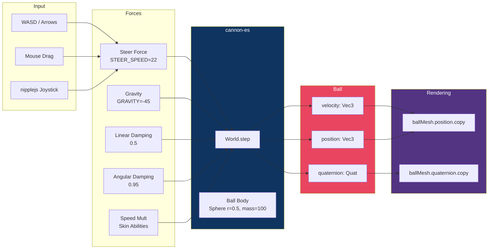
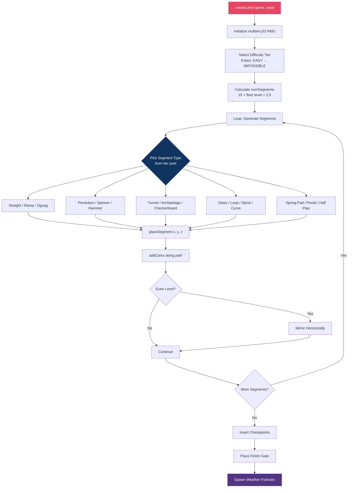
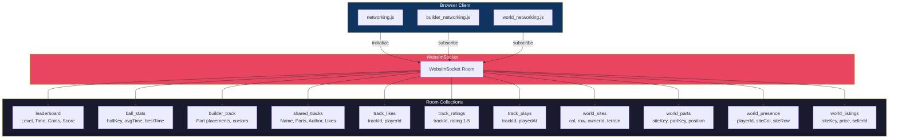
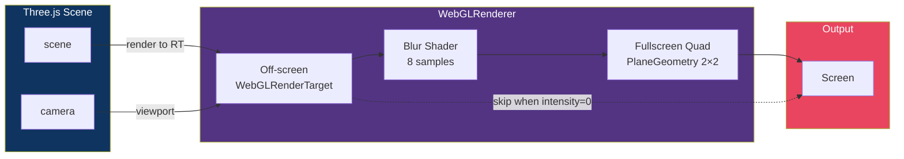
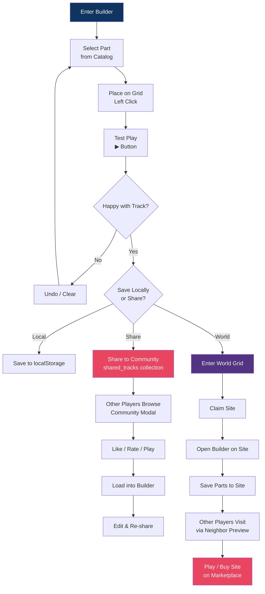

# Going Balls — Architecture Diagrams

> Render these in any Mermaid-compatible viewer (GitHub, GitLab, VS Code, Mermaid Live Editor).

---

## 1. High-Level Module Architecture

```mermaid
graph TB
    subgraph Bootstrap["main.js — DI Bootstrap"]
        G[Game Class]
    end

    subgraph Core["Core Engine"]
        SC["engine/scene.js<br/>Three.js Scene · Camera · Renderer<br/>Materials · Sky/PMREM · Ball Skin"]
        PH["src/physics.js<br/>cannon-es World · Ball Body<br/>Forces · Collisions · Weather Particles"]
        LG["src/levelgen.js<br/>Procedural Level Gen<br/>40+ Segment Types · 9 Tiers"]
        RN["src/rendering.js<br/>rAF Loop · Camera Follow<br/>Speed Lines · Motion Blur"]
    end

    subgraph Data["Data & Persistence"]
        PR["src/persistence.js<br/>localStorage · mulberry32 RNG<br/>Sky/Powerup Configs · Weather AI"]
        BD["src/ball_db.js<br/>65+ Skin Definitions<br/>Single Source of Truth"]
        NT["src/notification_manager.js<br/>Toast Pool · Rate Limiting"]
    end

    subgraph AudioNet["Audio & Networking"]
        AU["src/audio.js<br/>Music · SFX Pool<br/>AudioContext Visualizer"]
        NW["src/networking.js<br/>WebsimSocket · Loading Manager<br/>Error Handlers"]
    end

    subgraph UI["User Interface"]
        UI_[src/ui.js<br/>Shop · Leaderboard · Ball Index<br/>Settings · Game State]
        BI["src/ball_index_ui.js<br/>Remote Stats Merge<br/>Equip/Buy/Level"]
    end

    subgraph VFX["Visual Effects"]
        SL["src/speed_lines.js<br/>64 LineSegments<br/>Velocity-linked opacity"]
        MB["src/motion_blur.js<br/>Two-pass directional blur<br/>Shader-based composite"]
    end

    subgraph Builder["Track Builder"]
        BC["catalog.js<br/>25+ Part Definitions<br/>5 Categories"]
        BS["builder_scene.js<br/>3D Builder Scene<br/>Grid · Placement"]
        BU["builder_ui.js<br/>Categorized Grid<br/>XP Bar · Actions"]
        BN["builder_networking.js<br/>Multiplayer Sync<br/>Community · Likes/Ratings"]
        BX["builder_xp.js<br/>XP & Leveling<br/>9 Rank Titles"]
    end

    subgraph Workshop["3D Workshop"]
        WA["ws_app.js — Entry Point"]
        WS["ws_scene.js · ws_controls.js<br/>ws_state.js · ws_selection.js"]
        WP["ws_painter.js · ws_sculpting.js<br/>ws_rigging.js · ws_wireframeEditor.js"]
        WE["ws_exporter.js · ws_loaders.js<br/>ws_gallery.js · ws_agent.js"]
    end

    subgraph World["World Grid"]
        WST["world_state.js<br/>WorldGrid · Sites<br/>Terrain Presets"]
        WNW["world_networking.js<br/>Real-time Sync<br/>Presence · Ownership"]
        WUI["world_ui.js<br/>Grid View<br/>Site Cards"]
        MP["marketplace.js<br/>Buy/Sell Sites<br/>Blueprints · History"]
        WM["world_minimap.js<br/>Neighbor Preview<br/>3D Thumbnail"]
        WAR["world_arvr.js<br/>AR/VR Pointers"]
    end

    G --> SC
    G --> PH
    G --> LG
    G --> RN
    G --> PR
    G --> AU
    G --> NW
    G --> UI_
    G --> BI
    G --> NT
    G --> SL
    G --> MB
    G --> BC
    G --> BS
    G --> BU
    G --> BN
    G --> BX
    G --> WA
    WA --> WS
    WA --> WP
    WA --> WE
    G --> WST
    G --> WNW
    G --> WUI
    G --> MP
    G --> WM
    G --> WAR

    SC -->|scene, camera, renderer| PH
    SC -->|materials, sky| LG
    PH -->|ballBody, collisions| LG
    PR -->|rng, configs| LG
    PR -->|ballConfigs| BD
    NW -->|room| BN
    NW -->|room| WNW
    RN -->|updateMotionBlur| MB
    RN -->|updateSpeedLines| SL

    style Bootstrap fill:#1a1a2e,stroke:#e94560,color:#fff
    style Core fill:#16213e,stroke:#0f3460,color:#fff
    style Data fill:#1a1a2e,stroke:#533483,color:#fff
    style AudioNet fill:#1a1a2e,stroke:#e94560,color:#fff
    style UI fill:#16213e,stroke:#0f3460,color:#fff
    style VFX fill:#1a1a2e,stroke:#533483,color:#fff
    style Builder fill:#0f3460,stroke:#e94560,color:#fff
    style Workshop fill:#533483,stroke:#e94560,color:#fff
    style World fill:#16213e,stroke:#0f3460,color:#fff
```

---

## 2. Game Loop (Per Frame)

---

## 3. Data Flow — Ball State

---

## 4. Level Generation Pipeline

---

## 5. Multiplayer Architecture

---

## 6. Rendering Pipeline

---

## 7. Builder → Community → World Flow

---

*Render with: GitHub (paste into .md), [Mermaid Live Editor](https://mermaid.live), or VS Code Mermaid extension.*
