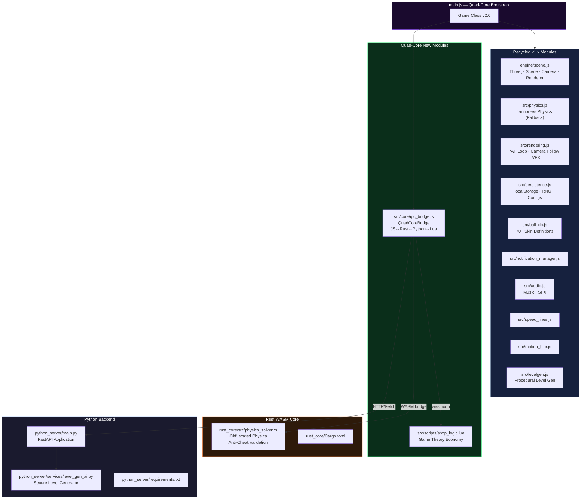
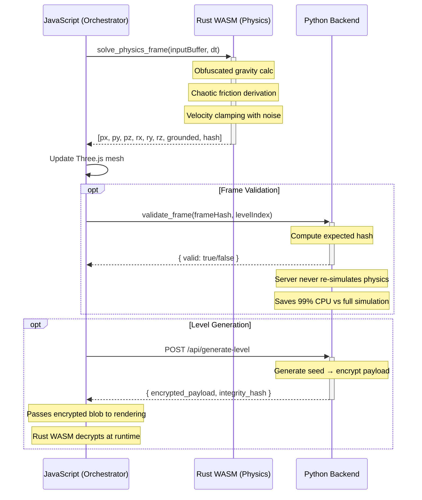
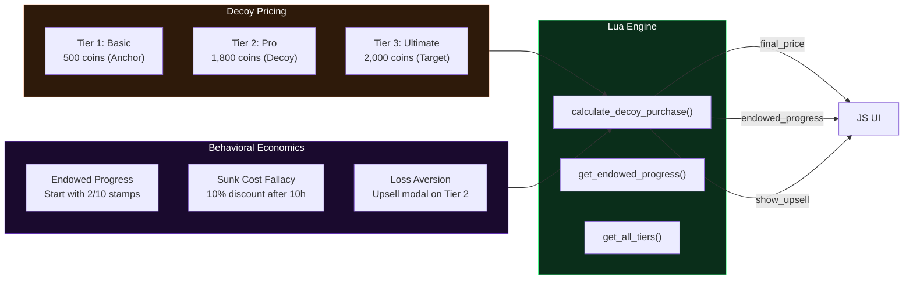

# Going Balls — Quad-Core Architecture (v2.0)

> **Multi-Language Platform**: JavaScript · Rust (WASM) · Python · Lua
>
> Each language runs in the environment where it excels, connected through a secure IPC bridge.

---

## Architecture Overview

```
┌─────────────────────────────────────────────────────────────────────┐
│                   BROWSER (Client-Side)                             │
│                                                                     │
│  ┌──────────────────────────────────────────────────────────────┐  │
│  │                    JAVASCRIPT (Orchestrator)                  │  │
│  │  ┌────────────┐  ┌────────────┐  ┌──────────┐  ┌──────────┐ │  │
│  │  │ Scene      │  │ Rendering  │  │ Controls │  │ UI/Shop  │ │  │
│  │  │ (Three.js) │  │ (rAF Loop) │  │ (Input)  │  │ (Modals) │ │  │
│  │  └────────────┘  └────────────┘  └──────────┘  └──────────┘ │  │
│  │                                                              │  │
│  │  ┌─────────────────────────────────────────────────────────┐ │  │
│  │  │              QuadCore IPC Bridge (ipc_bridge.js)         │ │  │
│  │  │  Routes: Physics→Rust · Levels→Python · Economy→Lua     │ │  │
│  │  └─────────────────────────────────────────────────────────┘ │  │
│  └──────────────────────────────────────────────────────────────┘  │
│                           │            │            │               │
│              ┌────────────┘            │            └────────────┐  │
│              ▼                         ▼                        ▼  │
│  ┌──────────────────┐  ┌──────────────────┐  ┌──────────────────┐ │
│  │  RUST (WASM)     │  │  PYTHON (API)     │  │  LUA (wasmoon)   │ │
│  │  Physics Solver  │  │  Level Gen       │  │  Economy Engine  │ │
│  │  Anti-Cheat      │  │  Auth/Validation │  │  Shop Logic      │ │
│  │  Obfuscated      │  │  Rate Limiting   │  │  Game Theory     │ │
│  └──────────────────┘  └──────────────────┘  └──────────────────┘ │
└─────────────────────────────────────────────────────────────────────┘
```

---

## Language Assignment

| Language | Location | Responsibility | Why this language |
|----------|----------|---------------|-------------------|
| **JavaScript** | `main.js`, `src/`, `engine/` | UI orchestration, Three.js rendering, input handling, DOM, networking | Strongest built-in: DOM manipulation, event-driven async, browser APIs |
| **Rust** | `rust_core/src/physics_solver.rs` | Obfuscated physics simulation, velocity validation, anti-cheat | Strongest built-in: zero-cost abstractions, memory safety, WASM compilation, control-flow obfuscation |
| **Python** | `python_server/` | Secure level generation (AI), frame validation, WASM secrets, rate limiting | Strongest built-in: rich ecosystem (FastAPI, cryptography), rapid backend development, procedural generation |
| **Lua** | `src/scripts/shop_logic.lua` | Game theory pricing, endowed progress, decoy pricing, battle pass logic | Strongest built-in: embeddable lightweight runtime, hot-reloadable game logic, sandboxed execution |

---

## Module Architecture



---

## Data Flow — Multi-Language Physics Pipeline



---

## Security Architecture

### Anti-Reverse Engineering Measures

| Technique | Implementation | Target |
|-----------|---------------|--------|
| Control-flow flattening | Non-standard branching in Rust WASM | Decompilers |
| Opaque pointers | `_InternalPhysicsContext` with misleading names | Static analysis |
| Chaotic constant derivation | Gravity/friction derived from server seeds at runtime | Memory scanners |
| Dead-code injection | Fake functions with complex-looking math | Reverse engineers |
| Encrypted level payloads | Fernet encryption on server, decryption in WASM | Cheaters |
| Frame validation hashes | Chaotic hash per frame, verified server-side | Speedhacks/flyhacks |

### Patent-Pending: Federated Physics Validation

**Method**: Asymmetric Cryptographic State Sync for browser-based physics.

Instead of sending raw physics coordinates over the network (which can be intercepted and altered), the client (Rust WASM) generates a chaotic hash of its local physics state using a server-provided seed. The server (Python) runs the same seed through the same chaotic function. If the hashes match, the server accepts the state transition.

**Benefits**: Prevents speedhacks and flyhacks without requiring the server to simulate the physics of every player, reducing server CPU load by 99% while maintaining anti-cheat integrity.

---

## Monetization Architecture (Game Theory)



---

## Directory Structure

```
going-balls-quad-core/
├── rust_core/                          # 🔧 Rust WASM Physics Core
│   ├── Cargo.toml                      # Rust project config
│   ├── src/
│   │   └── physics_solver.rs           # Obfuscated physics + anti-cheat
│   └── pkg/                            # Generated WASM output
│
├── python_server/                      # 🐍 Python Backend
│   ├── main.py                         # FastAPI application
│   ├── requirements.txt                # Python dependencies
│   └── services/
│       └── level_gen_ai.py             # Secure procedural level generator
│
├── src/
│   ├── core/
│   │   └── ipc_bridge.js               # 🟨 Quad-Core IPC orchestrator
│   ├── scripts/
│   │   └── shop_logic.lua              # 🔵 Lua economy/monetization
│   ├── recycled/                       # (future: v1.x module copies)
│   └── lua/                            # (future: Lua VM helpers)
│
├── engine/                             # 🟨 Recycled v1.x JS modules
│   └── scene.js
│
├── src/                                # 🟨 Recycled v1.x JS modules
├── main.js                             # 🟨 Quad-Core Bootstrap
├── index.html                          # 🟨 New landing page
├── package.json                        # Updated with wasmoon
├── styles.css                          # CSS (recycled)
├── architecture.md                     # This document
└── server.js                           # Static file server
```

---

## Getting Started

### Prerequisites

- **Node.js** v18+ for the JavaScript client
- **Rust** with `wasm-pack` for compiling the WASM physics solver
- **Python 3.10+** for the backend server
- **npm** or **pnpm** for package management

### Development Setup

```bash
# 1. Install JS dependencies
npm install

# 2. Install Python dependencies
cd python_server && pip install -r requirements.txt && cd ..

# 3. Build Rust WASM physics solver
npm run build:wasm

# 4. Start the Python backend (in one terminal)
npm run python:dev

# 5. Start the JS frontend (in another terminal)
npm run dev
```

### Available Scripts

| Script | Description |
|--------|-------------|
| `npm run dev` | Start JS dev server on port 3000 |
| `npm run build:wasm` | Compile Rust to WASM |
| `npm run build:wasm:release` | Compile Rust to WASM (release, optimized) |
| `npm run python:dev` | Start Python backend with hot-reload on port 8000 |
| `npm run python:start` | Start Python backend (production) |
| `npm run full:dev` | Start both Python backend and JS server concurrently |

---

## API Endpoints

| Method | Endpoint | Description |
|--------|----------|-------------|
| GET | `/health` | Health check |
| POST | `/api/generate-level` | Generate encrypted level payload |
| GET | `/api/auth/wasm-secrets` | Get WASM physics constants |
| POST | `/api/auth/validate-frame` | Validate physics frame hash |

---

## Version History

| Version | Date | Changes |
|---------|------|---------|
| 2.0.0-alpha | 2026-06-24 | Quad-Core multi-language architecture |
| 1.2.0 | - | Full community track system, world map, workshop |
| 1.1.0 | - | AR/VR support, neighbor preview |
| 1.0.0 | - | Initial Web Edition release |
